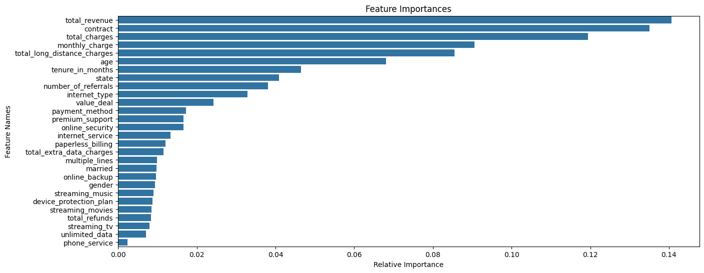
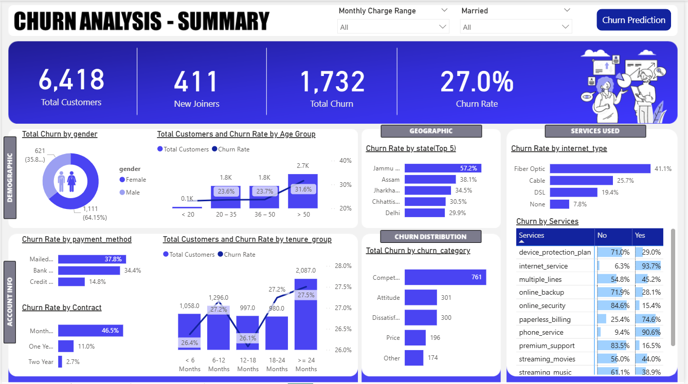
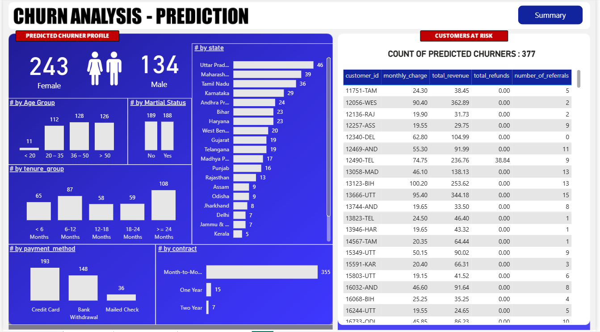

# 📊 Customer Churn Analysis & Prediction | Power BI + SQL + Machine Learning

## 🔍 Overview
This project provides an end-to-end **Customer Churn Analysis** solution for a telecom company using **ETL (SQL Server)**, **Power BI Dashboards**, and **Machine Learning (Random Forest)**.

It identifies **key churn drivers**, visualizes **customer behavior**, and predicts **future churners** to support business retention strategies.

---

## 🎯 Objectives
- Extract, clean, and transform customer data (ETL using SQL Server)
- Design **interactive Power BI dashboards** for churn insights
- Develop a **Random Forest model** to predict at-risk customers
- Visualize **feature importance** and integrate results with Power BI

---

## 🧩 Tech Stack
- **SQL Server** – ETL & Data Processing  
- **Power BI** – Data Visualization & Reporting  
- **Python (Scikit-learn, Pandas, NumPy, Matplotlib)** – Machine Learning  
- **Jupyter Notebook** – Model Building  
- **Excel/CSV** – Data Storage  

---

## ⚙️ ETL Workflow
1. Imported raw telecom customer data into SQL Server  
2. Performed data cleaning and transformation using SQL queries  
3. Created structured tables and views for Power BI integration  
4. Exported the processed data for Python-based churn prediction  

---

## 🧠 Machine Learning Model
**Algorithm:** Random Forest Classifier  
**Objective:** Identify customers likely to churn based on behavioral and demographic data  

### 🔍 Feature Importance (Top Predictors)
- Total Revenue  
- Contract Type  
- Total Charges  
- Monthly Charge  
- Tenure in Months  
- Number of Referrals  
- Internet Type  
- Payment Method  

---

## 📈 Power BI Dashboards

### 🧾 **Churn Analysis – Summary Page**
- Total Customers: 6,418
- New Joiners: 411  
- Total Churn: 1,732  
- Churn Rate: **27.0%**  
- Insights by gender, age group, state, contract, payment method, and internet type  

---

### 🤖 **Churn Analysis – Prediction Page**
- Total Predicted Churners: 377  
- Breakdown by age, tenure, payment method, contract type, and state  
- Customer-level details (monthly charge, total revenue, referrals, etc.)  

---

## 📂 Files Included
| File | Description |
|------|--------------|
| `Churn_Analysis.pbix` | Power BI dashboard file |
| `churn_prediction_random_forest.ipynb` | Machine learning notebook |
| `predictions.csv` | Predicted churner dataset |
| `output.png` | Feature importance visualization |
| `1_churn_analysis_summary.png` | Power BI summary page |
| `2_churn_analysis_prediction.png` | Power BI prediction page |

---

## 🗂️ Dataset
**Source:** [Kaggle - Telecom Customer Churn Dataset](Data/Customer_Data.csv)

---

## 🧾 Key Insights
- **Month-to-Month contracts** have the highest churn rate (46.5%).  
- **Fiber optic internet users** contribute to 41% of churn.  
- Customers with **<12 months tenure** are more likely to churn.  
- **Credit card users** have the lowest churn rate.  
- The **Random Forest model** accurately predicted potential churners based on multiple behavioral factors.

---

## 👨‍💻 Author
**Ramesh Sonta**  
🎓 B.Tech (Final Year), IARE College  
💼 Data Analyst & Power BI Enthusiast  
🔗 [LinkedIn Profile](https://www.linkedin.com/in/sonta-ramesh/)  
📂 [GitHub Projects](https://github.com/SontaRamesh)
